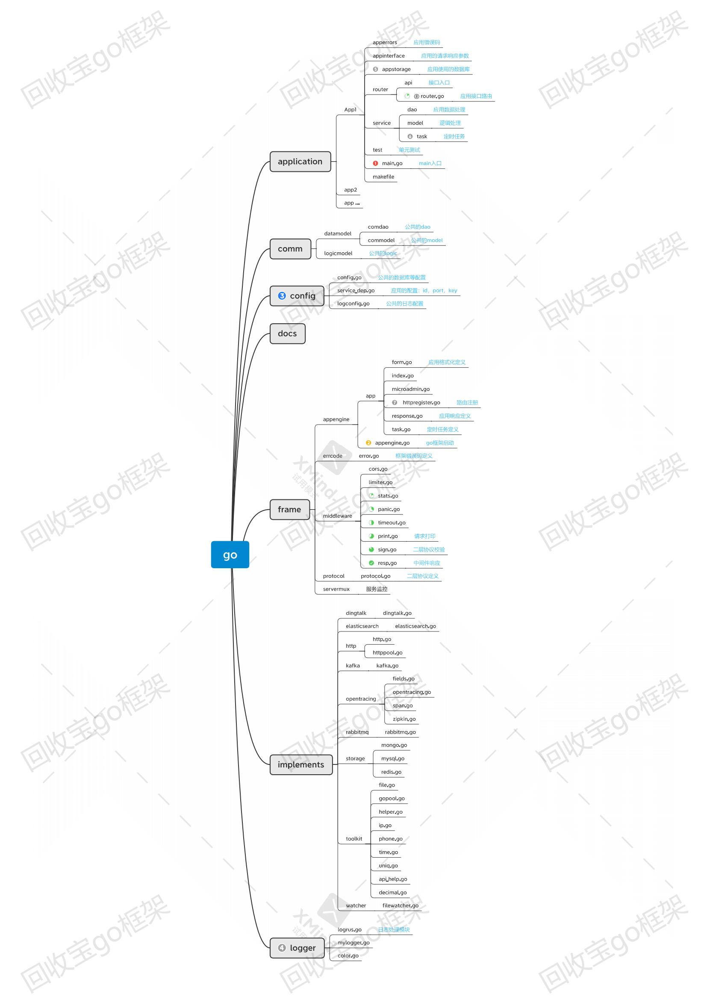
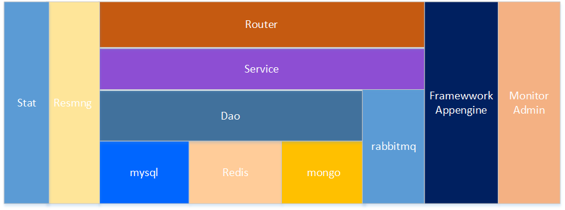

# eva_services_go
价格组使用的go框架


## 日志打印
```
日志配置文件：/huishoubao/config/GoAppLogConfig.xml
运行日志默认目录：/data/log/cgi_server/app/app.log.xxxx-xx-xx
接口上报日志默认目录：/data/log/cgi_server/app/app.log.report.xxxx-xx-xx
zipkin日志默认目录：/data/log/zipkin/app/app.log.zipkin.log.xxxx-xx-xx

每次接口请求（每个协程），都会生产一个唯一的context_id，可以通过这个id查询出该请求运行
打印的全部日志
例如：grep 7360b900bbaeab6d /data/log/cgi_server/testapp/testapp.log.xxxx-xx-xx
```

## 框架使用
```
创建新应用（app2）：
1、在application目录下，复制testapp项目，并重命名为新项目名app2
2、在application/app2目录下，使用“在路径下替换”，把/testapp/替换为/app2/
3、修改application/app2/main.go的：AppName、serverCfgFile
4、修改application/app2/apperrors 的错误码
5、修改application/app2/appstorage，根据项目实际需要，修改初始化的数据库连接
6、修改application/testapp/router，根据项目实际需要，修改路由表
7、开始进行项目开发
8、使用 make 命令进行编译
9、使用 make start 命令启动应用（包含重启）
```

## 框架退出
```
使用 kill -15 命令
退出顺序：
1、http服务退出：停止接收请求，等待运行中的请求结束（设置超时），退出
2、定时任务退出
3、回调应用退出接口：例如：dao等
4、打印系统最后退出
```

## 框架结构


